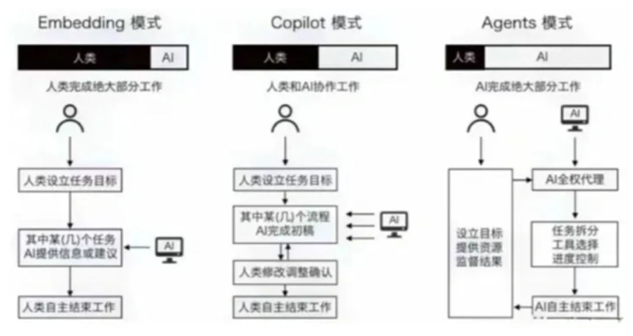

## 分类

生成式AI与人类的交互包括三个协作模式：嵌入模式、副驾驶模式、智能体模式。

* 嵌入模式：人类通过拆解目标引导AI完成任务，突显了人类在决策中的主导作用
* 副驾驶模式：人类与AI共同促成了目标的达成
* 智能体模式：AI能够自主理解、拆解、规划和执行任务。
* 这三种模式中，**决策权逐渐由人类转向AI**。

## Embedding

* 合作模式：人类设定目标、拆分成具体步骤、以自然语言与AI交互，逐步引导AI生成结果。
* 人类主导决策，AI充当执行人类命令的工具。

## **Copilot**

* 合作模式：**AI将全程参与整个工作流程，从提供初始建议、给出框架，一直到协助完成流程的各个阶段。**
* AI的**决策权**明显**增大**。在此模式下，人类与AI的关系更像是合作伙伴。**AI不仅在后续流程中与人类互动生成最终结果，而且在拆分目标时，也能协助人类理清目标构成。**尤其是那些对于目标领域不熟悉的人，AI能够帮助他们梳理思路，从而更有效地达成目标。

## Agent

* 合作模式：智能体模式是一种更为**独立**和**自主**的模式。这种模式可以被理解为能够自主理解人类提出的问题，并基于这种理解来进行问题规划，进而自主决定需要执行哪些复杂任务的智能体。

* 核心流程：三个能力的循环：感知、规划和行动。

  * 感知：智能体能够从**环境中收集信息**并从中提取有用的信息。

  * 规划：智能体为实现特定目标而**制定决策**。

  * 行动：基于感知到的信息和规划**采取具体的动作**。

  * 在感知、规划和行动的循环中，智能体能够在不断地与环境的互动中来学习和优化自身的行为。

* **智能体模式具有更强的决策权、独立性和自主性**。**它强调AI能够自主感知环境，通过感知获取信息，进行规划、拆分任务并自主执行任务。**在智能体模式中，AI更像是一个自主学习的主体，具备了更强的独立思考和适应能力。在这一模式下，用户只是作为监督者和评估者的角色，引导任务目标并提供指导。

* 以游戏中的NPC为例，智能体模式可以使游戏中的虚拟角色更加逼真，更能给用户带来身临其境的体验感。NPC通过**感知游戏环境**，和与玩家的对话来识别玩家的行为和目标，然后基于此来**规划**制定相应的行动策略或者对话内容，**最终实现与玩家的互动**。在智能体模式下，NPC能够更自主地应对不同的情境和不同属性的玩家，**使得游戏体验更具挑战性和趣味性。**

## **结论**

在这三种协作模式的演化中，从人类主导的嵌入到AI与人类合作的副驾驶，再到AI自主执行的智能体，AI参与决策的权重逐渐增加，呈现出了渐进式的发展。