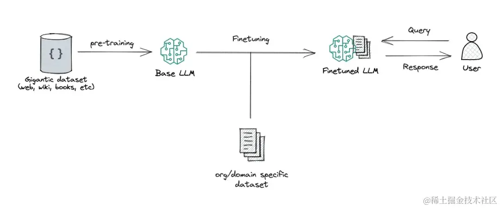
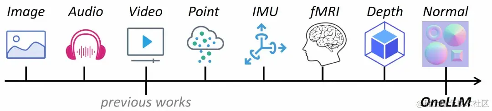
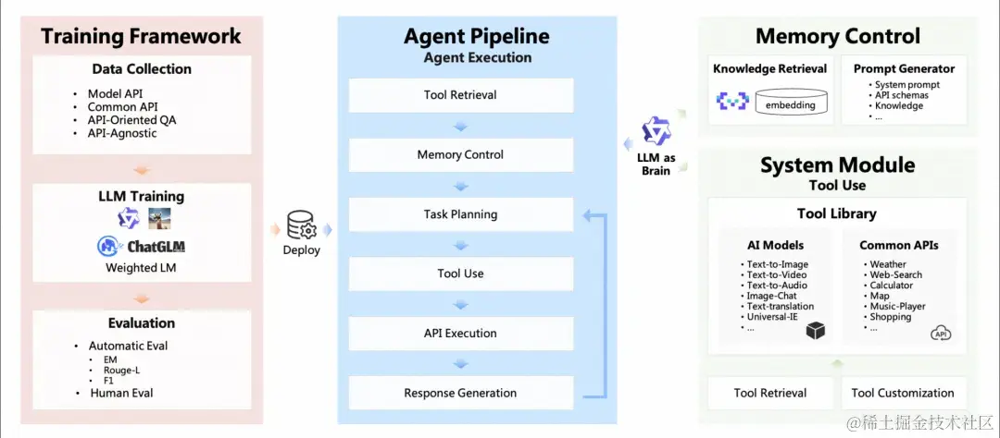
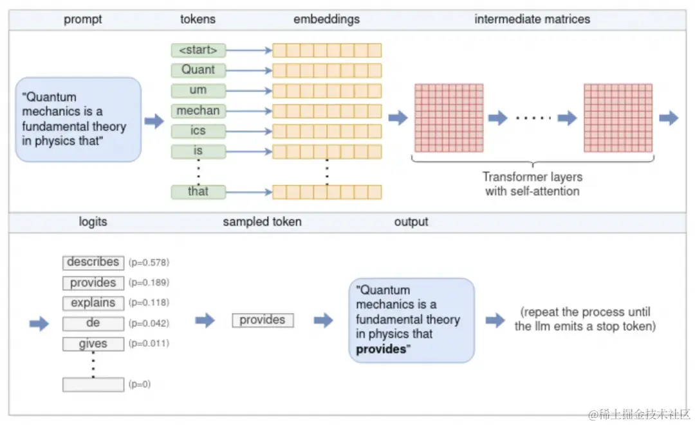
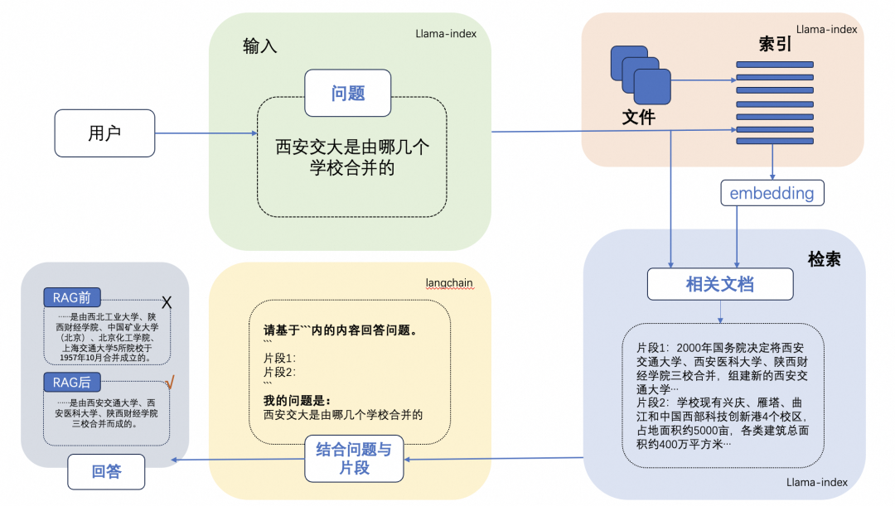
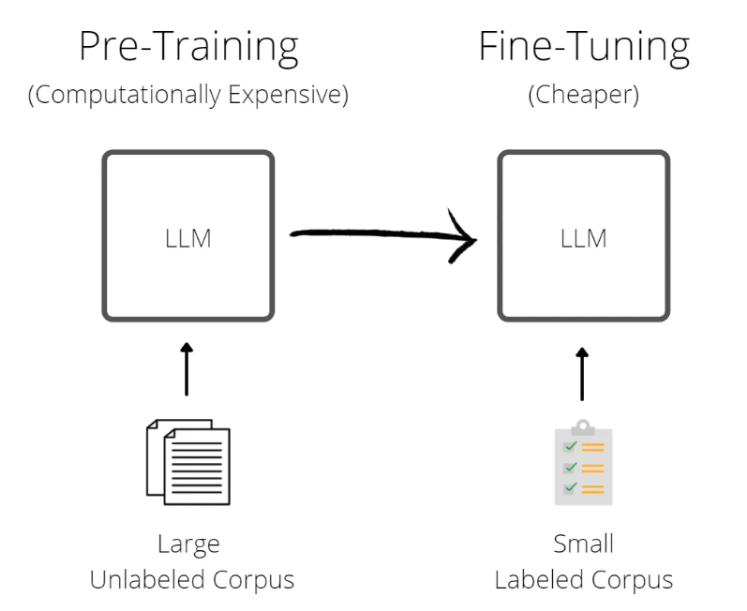
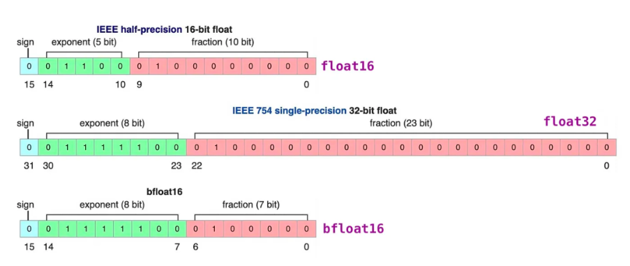

## 分类

首先，所有的大语言模型（LLM）的工作方式都是接收一些文本，然后预测最有可能出现在其后面的文本。

### base模型

**base 模型**，也就是**基础模型**，是在海量不同文本上训练出来的预测后续文本的模型。后续文本未必是对指令和对话的响应。

### chat模型

**chat 模型**，也就是**对话模型**，是在 base 基础上通过对话记录（指令 - 响应）继续做**微调和强化学习**，让它接受指令和用户对话时，续写出来的是遵循指令的，人类预期的 assistant 的响应内容。

### 多模态模型

多模态 LLM 将文本和其他模态的信息结合起来，比如图像、视频、音频和其他感官数据，多模态 LLM 接受了多种类型的数据训练，有助于 transformer 找到不同模态之间的关系，完成一些新的 LLM 不能完成的任务，比如图片描述，音乐解读，视频理解等。

### Agent模型

LM 具备 agent 大脑的能力，与若干关键组件协作，包括，

* **规划（planning）**：子目标拆解，纠错，反思和完善。
* **记忆（Memory）**：短期记忆（上下文，长窗口），长期记忆（通过搜索或者向量引擎实现）
* **工具使用（tool use）**：模型学习调用外部 API 获取额外的能力。

### Code模型

Code 模型在模型的预训练和 SFT 中加入了更多的代码数据占比，在代码的一系列任务，比如代码补齐，代码纠错，以及零样本完成编程任务指令。同时，根据不同的代码语言，也会有 python，java 等更多的专业语言代码模型。

## LLM流程

大语言模型是根据跨学科的海量的文本数据训练而成的，这也让大语言模型被大家认为最接近 “AGI” 的人工智能。然而，针对大语言模型，我们希望更好的使用 LLM，让 LLM 更好的遵循我们的指令，按照我们可控的方式和特定行业的知识输出答案。

### 模型推理

模型推理指利用训练好的模型进行运算，利用输入的新数据来一次性获得正确结论的过程。

参照图，流程如下：

1. **分词（Tokenization）**

输入文本首先被分词器（Tokenizer）处理，将其拆分为一个个“标记”（token）。这些标记可以是单词、子词，甚至是单个字符，具体取决于所使用的分词策略。每个标记都会映射到一个唯一的数字 ID，形成一个整数序列。例如，OpenAI 的 GPT 模型使用基于 Byte Pair Encoding（BPE）的分词器，将常见词汇和子词编码为标记。

------

2. **嵌入（Embedding）**

每个数字标记通过查找嵌入矩阵（Embedding Matrix）转换为一个固定维度的向量。这个向量捕捉了标记的语义信息，使模型能够以数学方式处理语言。这些嵌入向量共同构成了输入序列的嵌入矩阵。

------

3. **Transformer 模型处理**

嵌入矩阵作为 Transformer 模型的输入。Transformer 是一种深度神经网络架构，由多个层（Layer）组成，每层包含以下关键组件：

- **多头自注意力机制（Multi-Head Self-Attention）**：允许模型在处理每个标记时，关注输入序列中的其他标记，从而捕捉上下文关系。
- **前馈神经网络（Feedforward Neural Network）**：对每个位置的表示进行非线性变换，增强模型的表达能力。
- **残差连接（Residual Connections）和层归一化（Layer Normalization）**：帮助模型训练更稳定，防止梯度消失或爆炸。

每一层的输出作为下一层的输入，逐层提取更高层次的语义特征。

------

4. **Logits 计算**

Transformer 的最终输出通过一个线性变换层（通常称为“未嵌入层”或“输出层”）转换为 logits。每个 logit 对应于词汇表中的一个标记，表示该标记作为下一个输出的可能性。这些 logits 经过 softmax 函数处理，得到一个概率分布，用于预测下一个标记。

------

5. **采样与生成**

根据 logits 的概率分布，模型使用不同的采样策略（如贪婪搜索、温度采样、Top-k 或 Top-p 采样）选择下一个标记。选择的标记作为输出，并附加到当前的标记序列中。然后，模型重复上述过程，直到生成指定数量的标记，或遇到特殊的“序列结束”（EOS）标记。

------

6. **循环生成**

通过不断地将新生成的标记添加到输入序列中，并重复上述步骤，模型能够生成连贯的文本，直到满足停止条件。

### Prompt

prompt（提示词）是我们和 LLM 互动最常用的方式，我们提供给 LLM 的 Prompt 作为模型的输入，比如 “使用李白的口吻，写一首描述杭州的冬天的诗”。

#### few-shot prompt

few-shot：少样本学习，即通过在 prompt 中增加**一些输入和首选的优质输出的示例**，可以增强 LLM 的回答效果，更好的遵循我们的指令。但是更多的示例，会收到 LLM 的上下文窗口的限制，更多的 token 也会增加算力的消耗，也会影响 LLM 的响应速度。

### LLM+RAG

大型语言模型 (LLM) 演示显着的能力，但面临诸如此类的挑战：幻觉、过时的知识以及不透明、无法追踪的推理过程。**检索增强生成 (RAG)通过整合来自外部数据库的知识成为一个有前途的解决方案**，这增强了模型的准确性和可信度，特别是对于知识密集型任务，并且允许知识的不断更新和整合特定领域的信息。**RAG协同作用将LLM的内在知识与广泛的、外部数据库的动态存储库。**

### 微调

微调是我们向开源的LLM的CKPT提供更多的数据，使他具备额外的知识，或者改变他的一些原来的生成结果。

微调会改变模型的权重，并可以更好的控制模型的生成结果。对比few-shot prompting的方式，也可以解决通过few-shot prompting方式带来的token消费高，模型响应速度慢，以及上下文窗口不够的问题。

微调也会产生一些意向不到的结果，并有可能导致模型的通用能力下降，所以需要客观的评估模型微调的结果。

### 模型量化

模型量化是**使用低精度数据类型（例如 8 位整数 (int8)）而不是传统的 32 位浮点 (float32) 表示来表示模型中的权重、偏差和激活的过程。**通过这样做，它可以明显**减少推理过程中的内存占用和计算需求，从而能够在资源受限的设备上进行部署**。模型量化在计算效率和模型精度之间取得微妙的平衡。目前主要使用的LLM开源量化工具主要有：bnb，GPTQ，AWQ。

### 模型评估

LLM评估技术是研究和改进LLM的关键环节。LLM的评估是一项复杂的任务，需要考虑多个方面的评估维度和任务类型，**如文本对话、文本生成、多模态场景、安全问题、专业技能（coding/math）、知识推理**等。

LLM评估通常可以**人工评估和自动评估**两大类。其中，**自动评估（Automatic evaluation）技术又可以分为rule-based和model-based的方式。**其中，**rule-based主要面向客观题评价，评测题目通常包含标准答案**；**model-based方法主要用于评价主观题**，如复杂知识推理、多轮会话、文本生成等，**通过专家模型（Expert model）来评价目标LLM的生成效果**。

