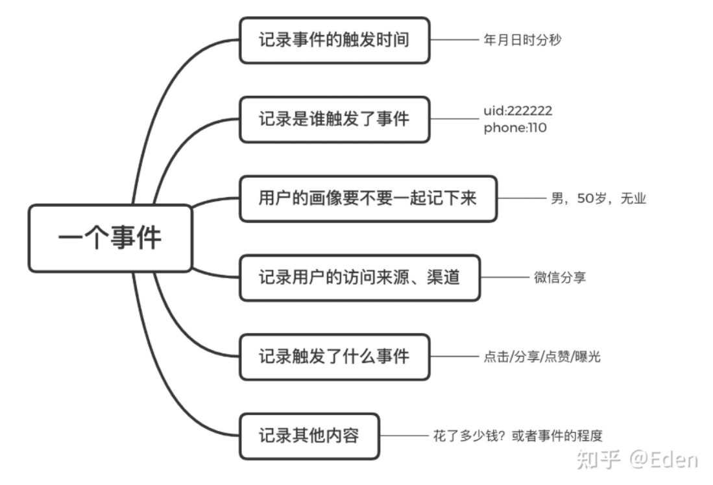

数据埋点，是指在产品的关键交互位置埋下标记，以记录用户的操作行为。

## 意义

1. **埋点帮助评价效果**：通过设计功能时预设埋点，通过埋点采集到数据，通过实际的数据能成为我们复盘内容、个人复盘的有力支撑
2. **埋点帮助迭代规划**：做完功能需要迭代，迭代可能来源于我们一开始的分期规划，但**最有效的方法还是通过一期的数据反馈，及时调整问题或弱点，达到敏捷开发**，功能效果最大化的目的
3. **埋点提供原始数据：**某一项功能设计的某些埋点采集到了某些信息，可以为我们以后的某个功能的规划提供数据基础

## 分类

### 位置

| 埋点类型   | 描述                                                       | 优点                                     | 缺点                                        | 综述说明                                                 |
| ---------- | ---------------------------------------------------------- | ---------------------------------------- | ------------------------------------------- | -------------------------------------------------------- |
| 客户端埋点 | 在客户端（如 App）进行埋点，通过用户在客户端的操作记录行为 | ✅ 可收集不经过接口的操作行为             | ❌ 需要发版更新，灵活性差                    | 需要在设计阶段就考虑清楚，**后续改动成本较高**           |
| 服务端埋点 | 在服务端通过调用接口来记录用户行为                         | ✅ 灵活，可在后端快速修改埋点逻辑         | ❌ 只能记录走接口的行为，离线操作不可追踪    | 后期可调整，适用于**接口触发类行为埋点**                 |
| 前端埋点   | 在 Web/H5 页面前端进行埋点，监听点击/曝光等操作            | ✅ 灵活易调试，适用于非接口触发的行为采集 | ❌ 精度略低，依赖浏览器环境，有误报/漏报风险 | **快速实现可视化行为追踪**，适用于**初期或频繁迭代**场景 |

### 技术

（1）代码埋点（手动埋点）

开发人员在代码中手动添加埋点代码，适用于需要精确控制埋点数据的场景。

**优点**：数据准确性高，适用于复杂业务逻辑。

**缺点**：开发成本较高，每次修改都需要研发介入。

（2）可视化埋点（无代码埋点）

通过可视化工具直接选择页面元素进行埋点，无需开发介入。

**优点**：实施成本低，操作便捷，适用于快速试验。

**缺点**：灵活性较低，可能无法满足复杂数据需求。

（3）无埋点（全埋点）

利用前端 SDK 自动收集用户行为数据，后续在数据平台进行分析。

**优点**：数据全面，无需提前定义埋点事件。

**缺点**：数据量庞大，分析难度高。

## 主要问题

1. **如何验证有效性：**想清楚现在做的功能，如何验证有效性，需要什么数据。
2. **在有所顾虑的地方埋点：**我们在每次做一个新需求的时候，很少有一个需求上线之后效果和我们预想的一模一样，可能是惊喜，也可能是失落。最早的MVP方案，我们有所顾虑的地方，要着重设计埋点，便于上线后我们第一时间，印证想法，调整思路。
3. **结合实际情况选择埋点类型**：
   1. 我做了一个卖东西的功能，然后我在复盘的时候可以拿出一个转化漏斗（aarrr模型），比如功能入口按钮点击（人数/次数）—页面曝光（人数/次数）—页面付款点击（人数/次数）—页面最终付款（人数/次数），然后我们做这个功能的时候担心付款的抓手效果不明显，那就严谨的规划**【页面付款点击（人数/次数）】**这个环节，从而去印证我们的想法

## 步骤

### **明确埋点目标**

在开始埋点之前，产品经理需要**明确想要获取的数据是什么，这些数据能帮助解答哪些业务问题。**例如：

- 提升用户注册率 → 监控注册流程中各环节的转化率
- 优化用户留存 → 追踪用户在关键功能上的使用情况
- 增加订单量 → 监测支付流程中的流失点

### 定义关键指标

在明确了目标之后，产品经理需要定义关键指标（Key Performance Indicators, KPIs）。关键指标是衡量目标实现程度的重要数据点。例如：

- **用户活跃度：**DAU（每日活跃用户）、WAU（每周活跃用户）、MAU（每月活跃用户）。
- **功能使用率：**某个功能的点击次数、使用频率。
- **用户转化率：**注册转化率、购买转化率、付费转化率。
- **用户留存率：**次日留存、七日留存、三十日留存。

### 详细描述埋点事件

埋点事件是指在用户进行某个操作时，产品记录下该操作的行为数据。详细描述埋点事件时，需要包括以下内容：

- **事件名称：**简洁明了地描述事件，例如“点击注册按钮”、“浏览商品详情页”。
- **触发条件：**描述事件触发的具体条件，例如“用户点击注册按钮时触发”、“用户进入商品详情页时触发”。
- **数据属性：**定义需要记录的额外数据，例如“按钮位置”、“页面加载时间”、“用户ID”。

详细描述埋点事件有助于技术团队准确实现埋点，确保数据收集的全面性和准确性。

### 设计数据结构

数据结构是指埋点数据的组织和存储方式。合理的数据结构设计可以提高数据的可用性和分析效率。常见的数据结构包括：

- 事件表：记录所有埋点事件及其属性。
- 用户表：记录用户的基本信息及行为数据。
- 时间维度表：记录事件发生的时间，支持按时间维度进行数据分析。

设计数据结构时，应考虑数据的可扩展性和查询效率，确保数据能够支持后续的分析和应用。

### 与技术团队充分沟通

因此，产品经理在撰写埋点文档时，应与技术团队保持充分的沟通，确保方案的可行性和有效性。

合作的关键点包括：

- 需求沟通：详细说明埋点需求，确保技术团队理解目标和关键指标。
- 技术实现：讨论埋点方案的技术实现方式，确保方案可行。
- 数据验证：协助技术团队进行数据验证，确保埋点数据的准确性。
- 持续优化：根据实际数据和业务需求，持续优化埋点方案。

### 埋点文档的编写规范

产品经理在编写文档时应遵循一定的规范。常见的规范包括：

- 结构清晰：
- 内容详细：**详细描述每个埋点事件及其属性**，确保技术团队能够准确实现。
- 示例丰富：**提供具体的示例**，帮助技术团队理解埋点需求。
- 定期更新：**根据业务需求和数据分析结果，定期更新埋点文档**，确保数据收集的有效性。

### 数据分析与应用

**埋点数据的最终目的是用于数据分析和业务决策。**产品经理在撰写埋点文档时，应考虑数据的应用场景，确保数据能够支持业务需求。常见的数据分析应用包括：

- 用户行为分析：通过分析用户行为数据，优化产品设计和用户体验。
- 功能效果评估：评估各个功能的使用情况和效果，指导功能迭代和优化。
- 转化率优化：分析用户转化路径，找出关键节点，优化用户转化率。
- 问题定位与排查：通过埋点数据快速定位产品中的问题，减少故障排查时间。

通过合理设计和应用埋点数据，产品经理可以为业务决策提供有力的数据支持，提升产品的竞争力和用户满意度。

## 埋点错误及优化建议

1. **埋点遗漏**
   1. 错误：关键功能没有埋点，导致数据缺失。
   2. 优化建议：制定埋点清单，确保核心流程中的每个环节都被追踪。
2. **埋点冗余**
   1. 错误：埋点过多，导致数据难以管理和分析。
   2. 优化建议：在埋点设计阶段就明确数据需求，避免无效埋点。
3. **埋点数据不一致**
   1. 错误：相同事件在不同端（Web/APP）上埋点规则不一致，导致数据无法对比。
   2. 优化建议：制定统一的埋点规范